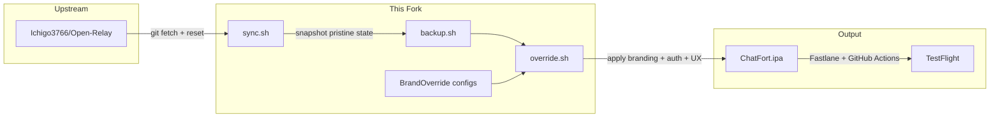
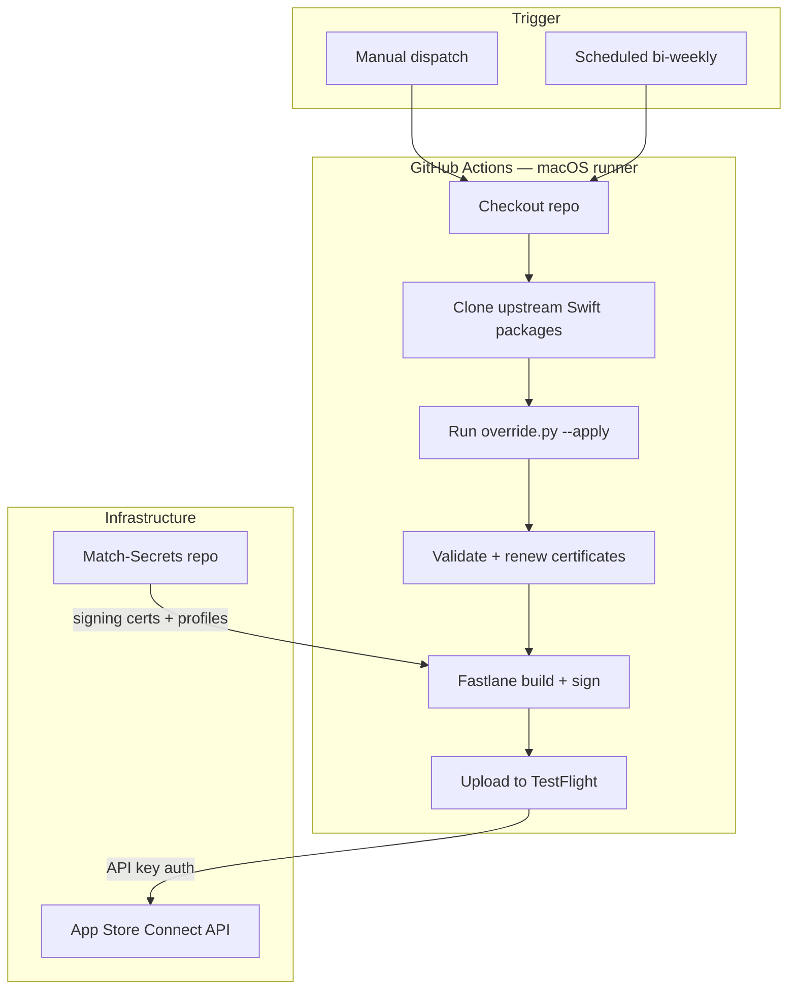

# ChatFort

A rebranded, self-hosted iOS client for AI chat — built as a non-invasive overlay on top of [Open Relay](https://github.com/Ichigo3766/Open-Relay).

> **This is a fork.** The upstream project is [Ichigo3766/Open-Relay](https://github.com/Ichigo3766/Open-Relay), a native SwiftUI iOS & iPadOS client for [Open WebUI](https://openwebui.com). Full credit to the original author. This fork changes zero upstream files — everything is applied through a scripted overlay system that can be cleanly reverted at any time.

---

## Why This Exists

I was using three separate apps daily — Claude, ChatGPT, and Gemini — each with its own interface, its own conversation history, and its own data silo. Conversations were locked inside each provider's cloud with no way to export, search across, or train on them later.

The goal was simple: **one app on my phone that replaces all three.**

The requirements were specific:

- **Single interface** — one app instead of three, with a UI polished enough that I wouldn't reach for the originals
- **Self-hosted backend** — conversations stored on my own [Open WebUI](https://openwebui.com) server, not in provider clouds
- **Model-agnostic** — talk to Claude, GPT, Gemini, or any other model through the same interface
- **Conversation ownership** — all chat history retained locally where it can be searched, exported, or used for fine-tuning later
- **No performance compromise** — the app had to match the responsiveness of the native first-party apps to actually replace them

Open Relay was the closest thing to what I needed — a well-built native iOS client for Open WebUI. But it needed branding, authentication, and UX adjustments to work with my infrastructure. Rather than maintaining a diverging fork that would constantly conflict with upstream, I built an overlay system that applies all changes non-destructively.

---

## What This Fork Adds

No upstream files are modified directly. All changes are applied by Python scripts in [`tools/BrandOverride/`](tools/BrandOverride/) and reverted cleanly before pulling upstream updates. The overlay covers:

| Layer | What changes |
|-------|-------------|
| **Branding** | App name, bundle IDs, icons, about screen, privacy policy, widget copy |
| **Authentication** | Native Authentik login flow (replaces WebView), OAuth2 refresh tokens, simplified logout |
| **Server config** | Pre-filled server URL, hidden connection UI, auto-connect on launch |
| **UX polish** | Tighter animations, snappier scroll behaviour, custom font stack (Styrene B, Circular Std, Apercu Mono Pro) |
| **CI/CD** | GitHub Actions workflows + Fastlane lanes for automated TestFlight builds |

---

## How the Overlay Works



The workflow:

1. **Sync** — `sync.sh` fetches the latest upstream, stashes fork-only files, hard-resets to `upstream/main`, then restores them. No merge conflicts, ever.
2. **Backup** — `backup.sh` snapshots every file the override will touch into a versioned `pristine/` directory.
3. **Override** — `override.sh` reads `brand_config.json` and eight modular config files in `configs/`, applies string replacements, copies assets, and injects the native login view. `--dry-run` previews everything first.
4. **Restore** — `restore.sh` copies the pristine snapshots back, reverting the repo to exact upstream state.

Every override is declarative JSON. The scripts are deterministic — same config, same output, every time.

---

## GitHub-Native Build Pipeline

The entire build runs on GitHub Actions. No Xcode install, no Mac required. Push a commit or trigger the workflow from the GitHub UI on any device — the pipeline applies overrides, signs the app, and uploads to TestFlight automatically.



Three workflows handle the full lifecycle:

| Workflow | Trigger | What it does |
|----------|---------|-------------|
| **Add Identifiers** | Manual | Registers bundle IDs (`com.chatfort.chatfort` + widget) with App Groups and push notification capabilities |
| **Create Certificates** | Manual or called by build | Validates secrets, checks certificate expiry, creates or renews signing certificates and provisioning profiles via Fastlane Match |
| **Build ChatFort** | Manual (TestFlight/Ad Hoc) or scheduled | Applies brand overrides, builds the IPA, signs with Match profiles, uploads to TestFlight, and archives build artifacts |

The build workflow runs on a scheduled cron (every other Sunday) to keep the TestFlight build fresh within the 90-day expiry window. Certificate renewal is fully automated — if a cert is expiring or the Match repo is empty, the pipeline creates new ones without intervention.

Signing credentials are stored in a private [Match](https://docs.fastlane.tools/actions/match/) secrets repo and encrypted with `MATCH_PASSWORD`. App Store Connect authentication uses an API key (key ID, issuer ID, private key) — no Apple ID or 2FA prompts in CI.

The result: edit a config file from a phone, push to `main`, trigger the workflow from the GitHub mobile app, and a signed build lands in TestFlight within minutes.

---

## Project Structure (Fork Additions Only)

```
chatfort-ios-open-relay/
├── tools/BrandOverride/
│   ├── brand_config.json          # brand values, string replacements, file lists
│   ├── configs/                   # modular overrides (auth, server, fonts, performance)
│   │   ├── 01_server_prefill.json
│   │   ├── 02_auth_native_login.json
│   │   ├── 02b_auth_native_login_view.json
│   │   ├── 03_auth_token_refresh.json
│   │   ├── 04_simplify_logout.json
│   │   ├── 05_remove_advanced_screen.json
│   │   ├── 06_snappy_performance.json
│   │   └── 07_custom_fonts.json
│   ├── scripts/                   # backup, restore, override, sync (Python + shell)
│   ├── Assets/                    # icon bundles, native login view, fonts
│   ├── docs/                      # Authentik setup, auth flow, token refresh guides
│   └── backups/                   # versioned pristine/override snapshots
├── fastlane/
│   ├── Fastfile                   # build, sign, upload lanes for ChatFort
│   └── Matchfile                  # match signing via private secrets repo
├── .github/workflows/             # CI: build, certificates, identifiers
├── Gemfile                        # Fastlane dependency pin
└── README.md                      # this file
```

Everything else in the repo is the unmodified upstream codebase (until `override.sh --apply` is run).

---

## Tech Stack

| Component | Role |
|-----------|------|
| [Open Relay](https://github.com/Ichigo3766/Open-Relay) | Upstream iOS client (SwiftUI, Swift 6, MVVM, SSE streaming, CallKit, MLX) |
| [Open WebUI](https://openwebui.com) | Self-hosted AI chat backend — routes to Claude, GPT, Gemini, local models |
| [Authentik](https://goauthentik.io) | Identity provider — OAuth2/OIDC, MFA, native Flow Executor API |
| [Fastlane](https://fastlane.tools) | iOS build automation — signing, provisioning, TestFlight upload |
| GitHub Actions | CI/CD — triggers override, builds IPA, deploys to TestFlight |
| Python | Override scripts — deterministic, diffable, no manual edits |

---

## Acknowledgments

This project is a fork of [Open Relay](https://github.com/Ichigo3766/Open-Relay) by [Ichigo3766](https://github.com/Ichigo3766). The upstream app is an excellent native iOS client for Open WebUI — well-architected, actively maintained, and feature-rich. This fork exists only to adapt it to a specific self-hosted setup; all core functionality comes from upstream.

---

## License

MIT — same as upstream. See [LICENSE](LICENSE).
