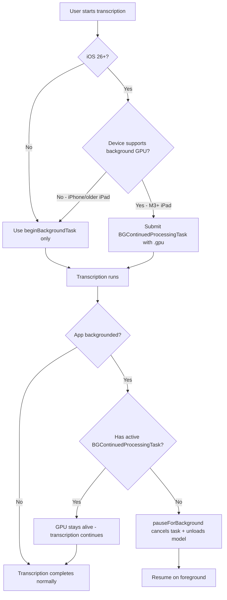

# Fix: Background GPU Crash on iOS 26

## Root Cause

The app crashes with `kIOGPUCommandBufferCallbackErrorBackgroundExecutionNotPermitted` because of **two compounding bugs**:

### Bug 1: `pauseForBackground()` blindly trusts iOS 26 version check

In [`OnDeviceASRService.pauseForBackground()`](Open UI/Core/Services/OnDeviceASRService.swift:224), the method returns early on iOS 26+ assuming background GPU access is available:

```swift
if #available(iOS 26, *) {
    logger.info("iOS 26+: background GPU access granted — not pausing ASR")
    return  // ← BUG: assumes GPU works, lets transcription continue
}
```

This means on iOS 26, ASR transcription is **never paused** when the app backgrounds — but the GPU permission is **never actually acquired**.

### Bug 2: No `BGContinuedProcessingTask` is ever scheduled

The entitlement (`com.apple.developer.background-tasks.continued-processing.gpu`) is present, and `Info.plist` has `BGTaskSchedulerPermittedIdentifiers` with `com.openui.asr.transcription`, but **nobody ever calls `BGTaskScheduler.shared.submit()`** with a `BGContinuedProcessingTaskRequest`. The entitlement alone does NOT grant background GPU access — you must actively request and be granted a `BGContinuedProcessingTask`.

### Bug 3: Background GPU is iPad M3+ only

Per Apple DTS Engineer Kevin Elliott (Apple Developer Forums, Aug 2025):

> *"The iPhone 16 Pro does not support background GPU. I believe it's only supported on iPads with an M3 or better (and not supported on any iPhone)."*

So even with a properly submitted `BGContinuedProcessingTask`, **no iPhone will ever get background GPU access**. The `if #available(iOS 26, *)` check is fundamentally wrong — it needs to be a **runtime capability check**.

### Crash Timeline

```
1. User starts transcription of 6-min audio file
2. User swipe-homes (app backgrounds)
3. scenePhase → .inactive/.background fires
4. Open_UIApp calls asrService.pauseForBackground()
5. pauseForBackground() sees iOS 26 → returns immediately (no-op)
6. MLX Metal command buffer still running on GPU
7. iOS revokes GPU access from backgrounded app
8. Metal throws: kIOGPUCommandBufferCallbackErrorBackgroundExecutionNotPermitted
9. MLX catches this as std::runtime_error → uncatchable from Swift → CRASH
```

## Fix Strategy

### Phase 1: Runtime GPU Check + BGContinuedProcessingTask (OnDeviceASRService.swift)

**A. Add a static property to check actual runtime background GPU support:**

```swift
/// Whether this device actually supports background GPU via BGContinuedProcessingTask.
/// Only iPads with M3+ on iOS 26+ return true. All iPhones return false.
static var supportsBackgroundGPU: Bool {
    if #available(iOS 26, *) {
        return BGTaskScheduler.supportedResources.contains(.gpu)
    }
    return false
}
```

**B. Track active `BGContinuedProcessingTask`:**

Add a property to track whether we have an active continued processing task that grants GPU access.

**C. Request `BGContinuedProcessingTask` when transcription starts:**

Before the `Task.detached` transcription work begins in `transcribe()`, submit a `BGContinuedProcessingTaskRequest` with `.requiredResources = .gpu` — but only if the device supports it.

**D. Fix `pauseForBackground()` to check runtime support:**

Replace the blanket `if #available(iOS 26, *)` with:
```swift
if #available(iOS 26, *), Self.supportsBackgroundGPU, activeContinuedTask != nil {
    logger.info("iOS 26+: BGContinuedProcessingTask active with GPU — not pausing ASR")
    return
}
```

This means:
- **M3+ iPads** with an active BGContinuedProcessingTask: transcription continues in background ✅
- **All iPhones** and older iPads: gracefully pause + resume on foreground ✅
- **No device**: crashes ✅

### Phase 2: Register the task handler (Open_UIApp.swift)

Register the `BGContinuedProcessingTask` handler in the app delegate or app init, using the already-configured identifier `com.openui.asr.transcription`.

### Phase 3: Same fix for MarvisTTS (MLXTextToSpeechService.swift)

The TTS service is already correctly handling background by stopping on `willResignActiveNotification`. No changes needed — the `stopAndUnload()` call in `Open_UIApp.swift` already handles TTS.

## Flow After Fix



## Files to Change

| File | Change |
|------|--------|
| [`OnDeviceASRService.swift`](Open UI/Core/Services/OnDeviceASRService.swift) | Add runtime GPU check, BGContinuedProcessingTask request/management, fix `pauseForBackground()` |
| [`Open_UIApp.swift`](Open UI/App/Open_UIApp.swift) | Register BGContinuedProcessingTask handler at app launch |

## Risk Assessment

- **Low risk**: The fallback path (pause + resume) is already well-tested on iOS < 26
- **No behavioral change on iPhone**: iPhone users get the same pause/resume behavior they always should have had
- **iPad M3+ improvement**: These users get uninterrupted background transcription (the original intent)
